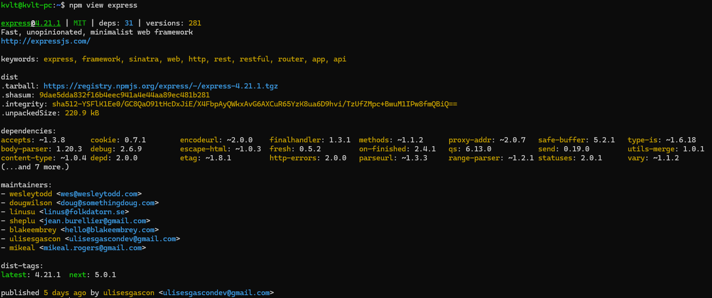

# Практическое занятие №2. Менеджеры пакетов

Матюхов А.И. - ИКБО-62-23

Разобраться, что представляет собой менеджер пакетов, как устроен пакет, как читать версии стандарта semver. Привести примеры программ, в которых имеется встроенный пакетный менеджер.

## Задача 1


    1. Name: Название пакета.
    2. Version: Версия пакета.
    3. Summary: Краткое описание пакета.
    4. Home-page: Ссылка на домашнюю страницу пакета.
    5. Author: Авторы пакета.
    6. Author-email: Адреса электронной почты авторов.
    7. License: Лицензия, под которой распространяется пакет.
    8. Location: Местоположение файлов пакета на вашей системе.
    9. Requires: Другие пакеты, от которых зависит текущий пакет.
    10. Required-by: Пакеты, которые требуют текущий пакет в качестве зависимости.

Чтобы скачать пакет прямо из репозитория нужно:

    1. Установить Git.

    2. Клонировать репозиторий.

        git clone https://github.com/matplotlib/matplotlib.git

    3. Установить пакет вручную.

        python setup.py install

## Задача 2



    1. Название и версия пакета:
        ◦ Название: express
        ◦ Версия: 4.21.1
        ◦ Лицензия: MIT
    2. Описание:
        ◦ Описание пакета: "Fast, unopinionated, minimalist web framework"
        ◦ Сайт: http://expressjs.com/
    3. Ключевые слова:
        ◦ express, framework, sinatra, web, http, rest, restful, router, app, api
    4. Информация о дистрибутиве:
        ◦ .tarball: Ссылка на архив с пакетом.
        ◦ .shasum: Контрольная сумма для проверки целостности архива.
        ◦ .integrity: Криптографически подписанная целостность архива.
        ◦ .unpackedSize: Размер распакованного пакета.
    5. Зависимости:
        ◦ Перечень пакетов, от которых зависит express, включая их версии.
    6. Список поддерживающих разработчиков:
        ◦ Имена и электронные адреса разработчиков, ответственных за поддержку и развитие пакета.
    7. Дистрибутивные теги:
        ◦ latest: Последняя версия (4.18.2).
        ◦ next: Следующая версия, на момент вывода - 5.0.0-beta.1.
    8. Дата публикации:
        ◦ Данные о том, когда пакет был опубликован в реестре пакетов npm.

Чтобы установить пакет без использования менеджера пакетов, можно зайти в репозиторий Express на GitHub или найти исходный код через указанный .tarball. Оттуда нужно скачать нужную версию вручную, затем разархивировать её и использовать пакет напрямую.

## Задача 3

Сформировать graphviz-код и получить изображения зависимостей matplotlib и express.

graphviz-код и изображение зависимостей matplotlib


## Задача 4


## Задача 5


## Задача 6

Решить на MiniZinc задачу о зависимостях пакетов для следующих данных:

```
root 1.0.0 зависит от foo ^1.0.0 и target ^2.0.0.
foo 1.1.0 зависит от left ^1.0.0 и right ^1.0.0.
foo 1.0.0 не имеет зависимостей.
left 1.0.0 зависит от shared >=1.0.0.
right 1.0.0 зависит от shared <2.0.0.
shared 2.0.0 не имеет зависимостей.
shared 1.0.0 зависит от target ^1.0.0.
target 2.0.0 и 1.0.0 не имеют зависимостей.
```


Преобразованный для удобства чтения ответ:

root 1.0.0 требует target 2.0.0

(ИЛИ)

root 1.0.0 требует foo 1.0.0

(ИЛИ)

root 1.0.0 требует foo 1.1.0 , который требует left 1.0.0 (И) right 1.0.0, потребуется shared 1.0.0, который требует target 1.0.0.
