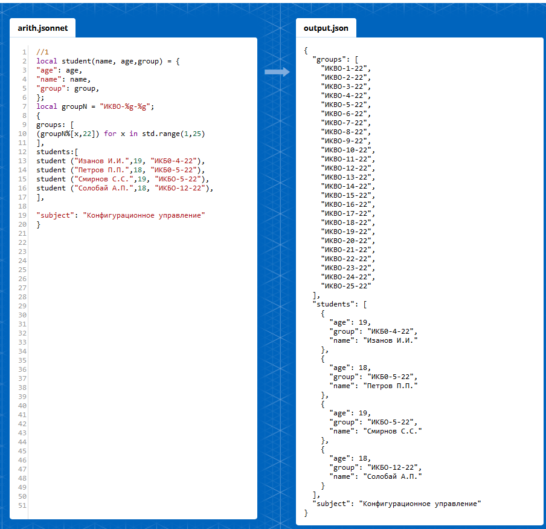
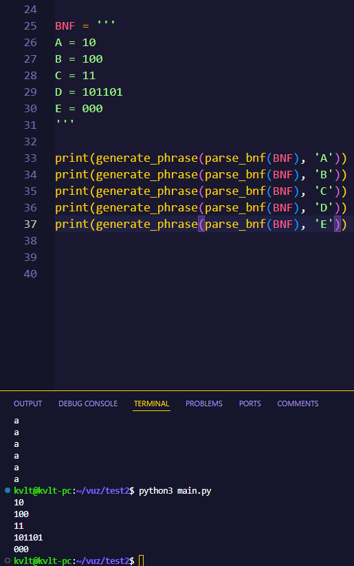
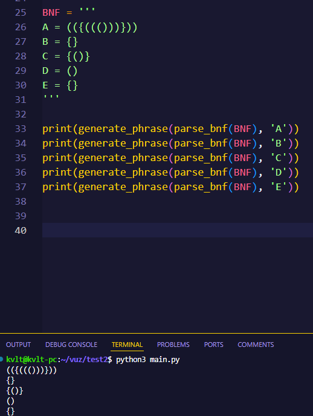
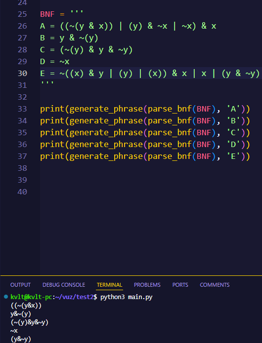

# Практическое занятие №3. Конфигурационные языки

Матюхов А.И. - ИКБО-62-23

Разобраться, что собой представляют программируемые конфигурационные языки (Jsonnet, Dhall, CUE).

## Задача 1

Реализовать на Jsonnet приведенный ниже пример в формате JSON. Использовать в реализации свойство программируемости и принцип DRY.



## Задача 2

Реализовать на Dhall приведенный ниже пример в формате JSON. Использовать в реализации свойство программируемости и принцип DRY.

```
{
  "groups": [
    "ИКБО-1-20",
    "ИКБО-2-20",
    "ИКБО-3-20",
    "ИКБО-4-20",
    "ИКБО-5-20",
    "ИКБО-6-20",
    "ИКБО-7-20",
    "ИКБО-8-20",
    "ИКБО-9-20",
    "ИКБО-10-20",
    "ИКБО-11-20",
    "ИКБО-12-20",
    "ИКБО-13-20",
    "ИКБО-14-20",
    "ИКБО-15-20",
    "ИКБО-16-20",
    "ИКБО-17-20",
    "ИКБО-18-20",
    "ИКБО-19-20",
    "ИКБО-20-20",
    "ИКБО-21-20",
    "ИКБО-22-20",
    "ИКБО-23-20",
    "ИКБО-24-20"
  ],
  "students": [
    {
      "age": 19,
      "group": "ИКБО-4-20",
      "name": "Иванов И.И."
    },
    {
      "age": 18,
      "group": "ИКБО-5-20",
      "name": "Петров П.П."
    },
    {
      "age": 18,
      "group": "ИКБО-5-20",
      "name": "Сидоров С.С."
    },
    <добавьте ваши данные в качестве четвертого студента>
  ],
  "subject": "Конфигурационное управление"
}
```

Решение:

TODO: скрины

```
let generate = https://prelude.dhall-lang.org/List/gene
let student = \(age: Natural) ->
(group : Natural) -> \(name: Text) ->{
age = age,
group="NK50-"++ Natural/show group ++ "-22",
name = name}
let group = (n: Natural) -> "MK50-"
++ Natural/show n ++ "-22"
let groups = generate 25 Text group
let student=[
student 19 4 "CMMPHOB C.C.",
student 18 5 "Петров П.П.",
student 18 12 "Солобай А.П."]
let subject = "Конфигурационное управление"
in {groups, student, subject}
```

s

## Задача 3

Язык нулей и единиц.


## Задача 4

Язык правильно расставленных скобок двух видов.



## Задача 5

Язык выражений алгебры логики.


