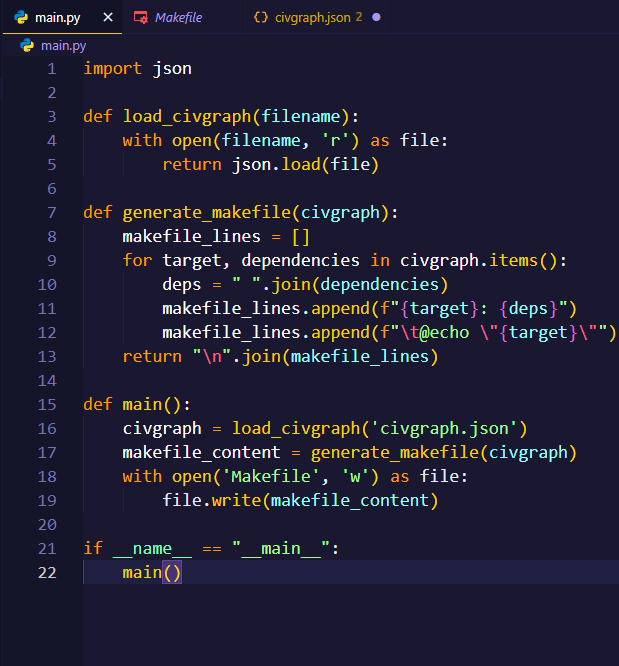
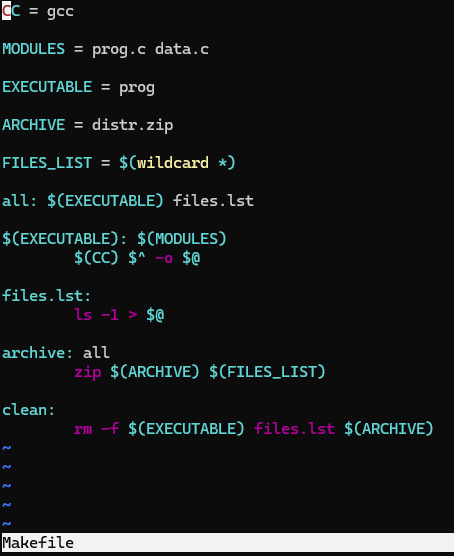

# Практическое задание №4. Системы автоматизации сборки

Матюхов А.И. - ИКБО-62-23

Работа с утилитой Make.

Изучить основы языка утилиты make

## Задача 1

Написать программу на Питоне, которая транслирует граф зависимостей civgraph в makefile в духе примера выше. Для мало знакомых с Питоном используется упрощенный вариант civgraph: [civgraph.json](civgraph.json).

## Задача 2

Реализовать вариант трансляции, при котором повторный запуск make не выводит для civgraph на экран уже выполненные "задачи".

## Задача 3

Добавить цель clean, не забыв и про "животное".

## Задача 4

